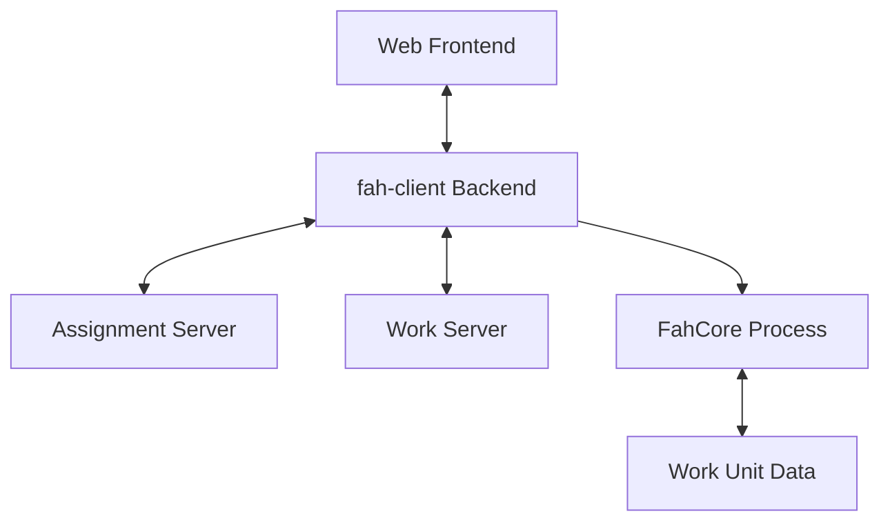
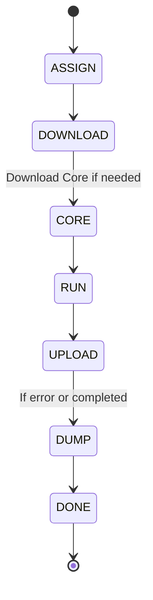

# Architecture of fah-client-bastet

This document provides a high-level overview of the Folding@home Client (Bastet) architecture.

## Overview

The `fah-client` is the backend component of the Folding@home desktop software. It manages protein folding simulations by:

1. Communicating with Assignment Servers to get work.
2. Managing "Slots" (Resource Groups) for CPU and GPU processing.
3. Controlling the lifecycle of "Cores" (scientific engines like Gromacs).

## Component Diagram

## Work Unit Lifecycle

A Work Unit (WU) goes through several states managed by the `Unit` class:

## Key Classes

- **`App`**: The main application controller.
- **`Unit`**: Manages a single chunk of work (Work Unit).
- **`Group`**: Manages resource allocation for units (similar to "slots").
- **`Core`**: Handles the downloading and status of scientific cores.
- **`CoreProcess`**: Abstraction for launching and monitoring the external FahCore executable.

## Threading and Event Model

The client uses the `cbang` library's event loop for asynchronous I/O and task scheduling. Most operations are non-blocking, ensuring responsiveness to both the frontend and the folding process.
